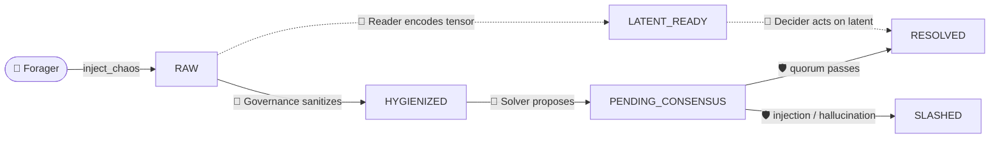

# 🐜 StigmergicAI

[](https://www.python.org/downloads/)
[](https://opensource.org/licenses/Apache-2.0)
[](https://GitHub.com/Naereen/StrapDown.js/graphs/commit-activity)

> **A zero-dependency, mathematically secure multi-agent framework based on Stigmergy, Latent State Transfer, and Byzantine Fault Tolerance.**

Forget API chaining, central orchestrators, and fragile `Agent-A → Agent-B` string-passing. **StigmergicAI** reimagines Multi-Agent Systems (MAS) not as corporate org charts, but as **living ecosystems**.

Nature solved distributed computing 500 million years before we invented the CPU. Ant colonies coordinate thousands of workers with no manager. Your immune system runs a planet-scale security audit with no central firewall. Your neurons exchange thought without ever flattening it into words. **StigmergicAI is a shameless plagiarism of that biology** — three battle-tested survival strategies, ported into a framework for LLM agents.

If LangGraph is a rigid assembly line, StigmergicAI is an ant colony: decentralized, self-healing, and mathematically protected against hallucination.

---

## 🩻 The Disease We're Curing

Today's orchestration frameworks suffer from two chronic conditions:

- **The String Tax 💸** — agents think in rich, high-dimensional latent space, then are forced to flatten that thought into lossy text just to talk to the next agent. It is brain damage by serialization.
- **Centralized Fragility 🥀** — a supervisor node holds the whole graph in memory. The supervisor dies, the organism dies with it. No ant colony ever collapsed because the "manager ant" had a heart attack.

Biology never made these mistakes. Neither should your agents.

---

## 🧠 The Three Architectural Horizons

Each horizon is a capability lifted straight from a living system.

### 🐜 Horizon 1 — Stigmergic Swarms · *The Ant Colony*

**The biology.** A single ant cannot comprehend the anthill's blueprint, and there is no "CEO ant" barking orders. Coordination emerges through **stigmergy**: an ant finds food, carries a piece home, and lays a chemical trail (a pheromone) on the ground. Another ant — with zero knowledge of the first — smells the trail, follows it, and reinforces it. When the food runs out, the pheromone evaporates and the traffic stops. The environment *is* the algorithm.

**The framework.** Agents here **never call each other**. They only read and mutate a shared semantic field — a database (`PheromoneGround` over SQLite, DynamoDB, or OpenSearch) that plays the role of the forest floor.

| Biology | StigmergicAI |
| :--- | :--- |
| The forest floor | `PheromoneGround` (the shared DB) |
| Pheromone concentration | `Entropy` (`CHAOS=1.0 … ZERO=0.0`) |
| The trail's scent | `Status` (`RAW → HYGIENIZED → RESOLVED`) |
| The pheromone evaporating | An ant setting `Entropy.ZERO` |
| A colony surviving a dead ant | A killed thread; the task stays durable in the DB |

> **Zero coupling, absolute resilience.** An ant wakes, senses high entropy (unresolved work), acts, lowers the entropy, and sleeps. Kill the process and the work simply waits in the database for the swarm to resume — eventual consistency with no orchestrator. (This is the Chaos Monkey test below.)

### 🛡️ Horizon 2 — Byzantine Cognitive Consensus · *The Immune System*

**The biology.** Your body does not ask the brain for permission to fight a virus. When an antigen enters the bloodstream, white blood cells detect it by molecular pattern-matching and destroy it on the spot. And crucially it is a *quorum*, not a dictator — when the immune system hallucinates and a lone cell misfires, healthy tissue gets attacked (autoimmune disease). Robustness comes from many independent sentinels having to agree.

**The framework.** You would not trust a single microservice to silently mutate production state — so why trust a single LLM? Before any mutation is committed, it must survive a **Byzantine Quorum**. The `VerifierAnt` is your white blood cell; a prompt injection (`drop table`, `ignore previous instructions`) or an LLM hallucination is the antigen.

| Biology | StigmergicAI |
| :--- | :--- |
| Antigen / pathogen | Prompt injection or hallucination |
| White blood cell | `VerifierAnt` |
| The immune response (a quorum of cells) | `SemanticRaft` (a jury of NLI judges) |
| Quarantine before the verdict | `Status.PENDING_CONSENSUS` |
| Pathogen neutralized | `Status.SLASHED` |
| All-clear, tissue healthy | `Status.RESOLVED` |

> A proposal is quarantined at `PENDING_CONSENSUS`. A jury of independent NLI nodes each asks, in its own words, *"does this action actually follow from the original request?"* If fewer than the threshold agree, the transaction is **slashed** and the poisoned trail evaporates so no other ant ever follows it. The vital organ (your ERP/SAP) is protected without ever consulting the user.

### 🧠 Horizon 3 — Latent State Transfer · *The Neural Synapse*

**The biology.** Neurons do not email each other sentences in English. The visual cortex does not send the amygdala the *text* "this is a lion" — it fires an electrochemical pulse, pure mathematical information, and the brain reacts in milliseconds. Forcing thought through language would mean saying every idea out loud before you could think the next one.

**The framework.** Instead of compressing reasoning into a string, agents pass the **hidden activation tensor itself**. A Reader distills a heavy document into a last-layer hidden state `[1, seq_len, hidden_dim]`, parks that tensor in the pheromone's `latent_blob`, and *erases the text*. A downstream agent injects the tensor straight into its own residual stream — pure context, zero String Tax.

| Biology | StigmergicAI |
| :--- | :--- |
| Electrochemical pulse | The serialized hidden-state tensor |
| Synaptic transmission | `latent_blob` on the `LATENT_READY` trail |
| Speaking out loud (lossy) | Classic string-based agent RPC |
| A sensory neuron encoding a stimulus | `HybridSolverAnt` (`engine="local"`) |
| A downstream neuron firing on the signal | A `Decider` agent reading only the tensor |

> In [`examples/03_latent_telepathy.py`](examples/03_latent_telepathy.py), one ant reads a 2,300-character report and the next ant reaches a decision having *never seen a single word of it* — only the tensor crossed the gap. Telepathy by mathematics.

---

## 🗺️ The Life of a Pheromone

A unit of work is born as chaos and dies as either a resolution or a slash. No agent dictates this journey; each caste simply reacts to the scent it is tuned to.



---

## ⚡ Quick Start: The Chaos Monkey Test

You don't need a heavy vector database to feel stigmergy. Let's run a swarm on a local SQLite "forest floor."

```bash
pip install -r requirements.txt
python examples/01_hello_stigmergy.py
```

**What happens?**

1. The **Forager** injects chaotic, high-entropy requests into the ground (e.g. `"update salary to 15k urgent"`).
2. The **Governance** ant smells entropy `≥ 0.7`, wakes asynchronously, sanitizes the payload, drops entropy to `0.2`, and lays a clean `HYGIENIZED` trail.
3. The **Solver** ant smells the clean trail, executes the safe business logic, and drives entropy to zero.

**The magic 🐒** — kill the Governance thread mid-run. *Nothing crashes.* The Forager keeps piling on work, the Solver idles (no hygiene to follow), and the `RAW` backlog simply accumulates, durable in the database. Revive Governance and watch it vacuum the backlog at lightning speed. **Eventual consistency with no Step Functions, no retry queue, no orchestrator** — exactly how a colony shrugs off a dead worker.

---

## 🐜 The Castes

Every caste reacts only to a scent (`Status`) and an entropy threshold. None of them know the others exist — they are wired together solely by the trails they leave on the ground.

| Caste | Role in the colony | Biological analog | Reacts to → leaves |
| :--- | :--- | :--- | :--- |
| `ForagerAnt` | Producer: floods the ground with work | Forager bringing food home | — → `RAW` |
| `GovernanceAnt` | Sanitizes raw payloads | Hygienic worker ant | `RAW` → `HYGIENIZED` |
| `SolverAnt` | Proposes a resolution for review | Worker executing a task | `HYGIENIZED` → `PENDING_CONSENSUS` |
| `VerifierAnt` | Runs the Byzantine quorum | White blood cell | `PENDING_CONSENSUS` → `RESOLVED` / `SLASHED` |
| `HybridSolverAnt` | Cloud text **or** local latent encoding | Sensory neuron | `HYGIENIZED`/`RAW` → `PENDING_CONSENSUS` / `LATENT_READY` |

> Castes are built by composition over a resilient `BaseAnt` heartbeat: a `ProducerAnt` secretes, a `ConsumerAnt` claims → metabolizes → commits. A failed `tick()` is logged and swallowed — one sick ant never kills the colony.

---

## 📦 Installation

StigmergicAI keeps a **near-zero-dependency** core (just `pydantic`). The deep-learning horizons are strictly opt-in, so `import stigmergic_ai` never pays the torch/transformers import tax.

```bash
# Horizon 1 — the stigmergic core (pydantic only)
pip install -r requirements.txt

# Horizons 2 & 3 — the cognition extras (torch + transformers)
pip install -e ".[cognition]"
```

> Requires **Python 3.10+**. Horizons 2 and 3 run fully offline in the examples and tests via deterministic mocks, so you can explore the entire architecture before downloading a single model weight.

---

## 🔬 Examples

| Demo | Horizon | What it proves |
| :--- | :--- | :--- |
| [`01_hello_stigmergy.py`](examples/01_hello_stigmergy.py) | 🐜 Swarms | Self-healing coordination — kill & revive a caste, lose zero tasks |
| [`02_byzantine_fault.py`](examples/02_byzantine_fault.py) | 🛡️ Consensus | A live jury slashing prompt injections while approving honest work |
| [`03_latent_telepathy.py`](examples/03_latent_telepathy.py) | 🧠 Latent | A decision made from a raw tensor — the source text never crossed |

```bash
python examples/02_byzantine_fault.py   # watch the immune system slash a hack
python examples/03_latent_telepathy.py  # watch one ant read another's mind
```

---

## 🧪 Testing

The consensus suite is fully deterministic and **torch-free** (every juror is a `MockNLIJudge`), so it runs in a fraction of a second and proves the import hygiene holds.

```bash
pip install pytest
python -m pytest tests/test_consensus.py -v
```

> 25 tests cover quorum arithmetic (2-of-3 passes, 1-of-3 slashes), deterministic red-flag slashing, crashing-juror resilience, and the guarantee that no deep-learning stack leaks into a core run.

---

## 🗂️ Project Structure

```text
src/stigmergic_ai/
├── core/
│   ├── environment.py     # 🐜 PheromoneGround, Pheromone, Entropy, Status — the forest floor
│   ├── consensus.py       # 🛡️ SemanticRaft, NLI judges — the immune system
│   └── latent_transfer.py # 🧠 tensor (de)serialization — the synapse
└── agents/
    ├── base_ant.py        # BaseAnt heartbeat · ConsumerAnt · ProducerAnt
    ├── concrete.py        # ForagerAnt · GovernanceAnt · SolverAnt
    ├── verifier_ant.py    # VerifierAnt (the white blood cell)
    └── hybrid_ant.py      # HybridSolverAnt (cloud text / local latent)
examples/   # three runnable horizon demos
tests/      # torch-free consensus suite
```

---

## 🏗️ Why not LangChain / CrewAI?

| Trait | Commercial Orchestrators | StigmergicAI | In nature |
| :--- | :--- | :--- | :--- |
| **Topology** | Centralized supervisor/nodes | Decentralized stigmergy | An ant colony |
| **Communication** | String-based RPC (lossy) | Tensor / latent injection | A neural synapse |
| **Fault tolerance** | Try/catch retries | Semantic Byzantine quorum | An immune system |
| **State persistence** | App memory (volatile) | Database physics (durable) | Pheromones in soil |

Commercial frameworks model a **corporation**. StigmergicAI models an **organism**. Organisms are older, and they don't go down when the manager quits.

## 🤝 Contributing
This is an experimental research project pushing the boundaries of Distributed Cognitive Systems. We welcome PRs for new Byzantine voting mechanisms, OpenSearch/DynamoDB grounds, and Latent Transfer utilities. New organs for the organism are always welcome.

## 📄 License
Apache License 2.0. See [`LICENSE`](LICENSE) for more information.
