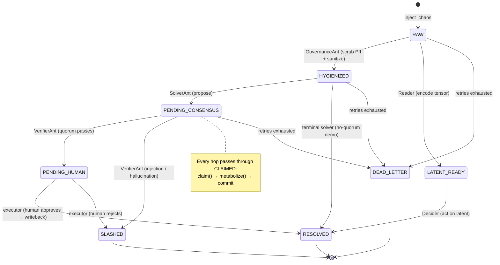

# State Machine

> The formal lifecycle of a unit of work (a `Pheromone`). This is not a
> narrative — it is the exact set of legal states and transitions defined in
> [src/stigmergic/core/environment.py](src/stigmergic/core/environment.py)
> (`Status`, `TERMINAL_STATUSES`, `STATE_TRANSITIONS`) and, when a ground is
> created with `enforce_transitions=True`, enforced at every `update_state`.

---

## 1. States

| Status | Terminal | Meaning |
| :--- | :---: | :--- |
| `RAW` | — | Freshly injected, untrusted, high entropy. Awaiting hygiene. |
| `CLAIMED` | — | An ant holds it and is metabolizing it (the transient hub). |
| `HYGIENIZED` | — | Sanitized/PII-scrubbed; safe for a solver to reason over. |
| `PENDING_CONSENSUS` | — | A proposal is staged, awaiting the Byzantine quorum. |
| `PENDING_HUMAN` | — | Machine-approved; parked for a human sign-off before commit. |
| `LATENT_READY` | — | A hidden-state tensor is parked in `latent_blob` (Horizon 3). |
| `RESOLVED` | ✅ | Terminal success. Entropy driven to zero. |
| `SLASHED` | ✅ | Terminal failure. Rejected by the quorum (injection/hallucination). |
| `DEAD_LETTER` | ✅ | Terminal failure. A poison-pill that exhausted its retry budget. |

`TERMINAL_STATUSES = {RESOLVED, SLASHED, DEAD_LETTER}`. Terminal units are never
claimed and have no outgoing transitions.

---

## 2. The transition table

Exactly as encoded in `STATE_TRANSITIONS` (source → the set of legal targets):

| From \ To | RAW | CLAIMED | HYGIENIZED | PENDING_CONSENSUS | PENDING_HUMAN | LATENT_READY | RESOLVED | SLASHED | DEAD_LETTER |
| :--- |:---:|:---:|:---:|:---:|:---:|:---:|:---:|:---:|:---:|
| **RAW** | | ● | ● | | | | | | ● |
| **CLAIMED** | ● | | ● | ● | ● | ● | ● | ● | ● |
| **HYGIENIZED** | | ● | | ● | | | ● | | ● |
| **PENDING_CONSENSUS** | | ● | | | ● | | ● | ● | ● |
| **PENDING_HUMAN** | | ● | | | | | ● | ● | ● |
| **LATENT_READY** | | ● | | | | | ● | | ● |
| **RESOLVED / SLASHED / DEAD_LETTER** | | | | | | | | | |

Reading notes:

- **`CLAIMED` is the hub.** Every caste's `claim()` moves a unit *into* `CLAIMED`
  and its commit moves it *out*. So each real hop is two DB transitions
  (`X → CLAIMED → Y`); the table above lists both halves.
- **`CLAIMED → RAW/HYGIENIZED/PENDING_CONSENSUS/PENDING_HUMAN/LATENT_READY`** are
  the *release/reclaim* edges — a lapsed lease or a failed metabolize returns the
  unit to the trail it was claimed *from*.
- **Any non-terminal → `DEAD_LETTER`** is the poison-pill escape hatch.

---

## 3. Diagram

---

## 4. Who drives each transition

| Transition | Actor (caste) | Guard |
| :--- | :--- | :--- |
| `∅ → RAW` | `ForagerAnt` / `ServiceNowIntakeAnt` (producers) | Redactor runs first; `idempotency_key` dedups |
| `RAW → HYGIENIZED` | `GovernanceAnt` | entropy ≥ threshold |
| `HYGIENIZED → PENDING_CONSENSUS` | `SolverAnt` / `KnowledgeSolverAnt` | proposal built from retrieval |
| `PENDING_CONSENSUS → PENDING_HUMAN` | `VerifierAnt` | quorum **passes** (≥ threshold approvals) |
| `PENDING_CONSENSUS → SLASHED` | `VerifierAnt` | quorum **fails** |
| `PENDING_HUMAN → RESOLVED` | executor (e.g. `GardenerAnt`) | human/oracle **approves** → writeback |
| `PENDING_HUMAN → SLASHED` | executor | human **rejects** (KB entry quarantined + corrected) |
| `RAW → LATENT_READY` | `HybridSolverAnt(engine="local")` | tensor encoded into `latent_blob` |
| `LATENT_READY → RESOLVED` | `Decider` | acts on the tensor alone |
| `* → CLAIMED` | any `ConsumerAnt.claim()` | atomic; stamps owner + lease + `claimed_from` |
| `CLAIMED → claimed_from` | `reclaim_expired_leases()` / retry release | lease lapsed **or** metabolize raised |
| `* → DEAD_LETTER` | `ConsumerAnt.tick()` | `retry_count > max_retries` |

> The demo wires `PENDING_CONSENSUS → PENDING_HUMAN → RESOLVED` (a two-tier gate:
> automated quorum first, then a human). A no-human configuration can go
> `PENDING_CONSENSUS → RESOLVED` directly; both edges are legal.

---

## 5. Reliability annotations

The lifecycle is overlaid with the reliability machinery from the core:

- **Lease.** `claim()` stamps `lease_expires_at = now + lease_seconds` and records
  `claimed_from` (the pre-claim trail). `reclaim_expired_leases()` reverts a
  lapsed claim to `claimed_from`, clears the owner, and **bumps `version`**.
- **Optimistic concurrency.** Every `update_state` does `version = version + 1`.
  A commit that passes `expected_version` only applies if the row is still at
  that version — so a reclaimed worker's late write is rejected (it does not
  appear as a transition at all; the row is untouched).
- **Retry → DLQ.** `retry_count` increments on each claim and resets on each
  successful progress commit. When it exceeds `max_retries`, the next claim
  routes the unit to `DEAD_LETTER` with a `dlq_reason`.
- **Enforcement.** With `enforce_transitions=True`, `update_state` raises
  `ValueError` on any hop not in the table above (the atomic `claim`/`reclaim`
  primitives manage the `CLAIMED` hop themselves and are not re-validated).

---

## 6. Mapping to a system of record

The ServiceNow demo maps the internal lifecycle onto incident states:

| Pheromone status | ServiceNow incident state |
| :--- | :--- |
| `RAW`, `CLAIMED`, `HYGIENIZED`, `PENDING_CONSENSUS`, `PENDING_HUMAN` | In Progress |
| `SLASHED` | Canceled |
| `RESOLVED` | Resolved |
| `DEAD_LETTER` | In Progress (flagged for an operator) |
